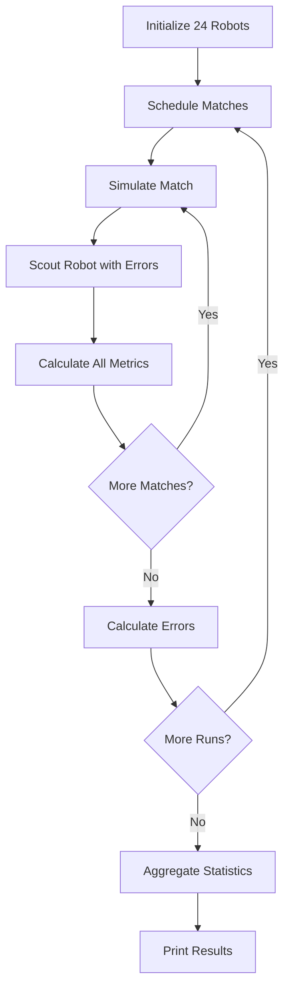

# FRC 2026 Scouting Simulation

## Overview

This simulation is designed to test different scouting methods for tracking robot shooting performance in FRC 2026. The goal is to find the most accurate and practical method for scouters to estimate how many fuel balls a robot shoots and hits during a match, without having to manually count 100-300 shots per robot.

## Simulation Architecture

### Core Components

#### 1. **Robot Models** (`robot_model.py`)
Each robot is defined with the following characteristics:
- **Magazine Size**: Total fuel capacity (20-60 balls)
- **Accuracy**: Shot accuracy percentage (50-95%)
- **Firing Rate Function**: Dynamic function determining how fast the robot shoots
- **Maximum Fire Rate**: Physical limit on how fast the robot can shoot (balls per second)

#### 2. **Robot Configurations**
The simulation includes **48 unique robot configurations** split into two sets:

**Time-Based Robots** (`robot_configs.py` + `fire_rate_functions.py`):
- 24 robots whose firing patterns are functions of time
- The fire rate changes depending on how long the robot has been shooting.

**Magazine-Based Robots** (`robot_configs_magazine_size.py` + `magazine_size_fire_rate_functions.py`):
- 24 robots whose firing patterns depend on magazine fill percentage
- The fire rate changes depending on how much fuel is remaining in the magazine.

#### 3. **Match Scheduling** (`match_maker.py`)
- Uses the official FRC scheduling algorithm
- Creates balanced matches with 6 robots (3 red, 3 blue)
- Minimizes repeat pairings between robots
- Configurable matches per robot (default: 10 matches)

#### 4. **Match Simulation** (`simulation_logic.py`)
Each match simulates realistic robot behavior:
- Robots perform 1-6 volleys (randomly chosen)
- Each volley uses 10-100% of magazine capacity
- Physics simulation with configurable time steps (default: 0.05 seconds)

#### 5. **Scouter Model** (`scouter_model.py`)
Simulates human scouter observations with realistic errors:
- **Time Error**: -25% to +175% (scouters struggle with timing precision)
- **Magazine Count Error**: ±10% (visual estimation of magazine fill)
- Applies variance to match-by-match observations

## Simulation Parameters

Key configurable parameters in `parameters.py`:

| Parameter | Defualt Value | Description |
|-----------|-------|-------------|
| `NUMBER_OF_RUNS` | 25 | How many full tournaments to simulate |
| `MATCHES_PER_ROBOT` | 10 | Matches each robot plays per tournament |
| `ITERATIONS` | 10,000 | Match scheduling algorithm iterations |
| `MIN_ACCURACY` | 0.50 | Minimum robot accuracy (50%) |
| `MAX_ACCURACY` | 0.95 | Maximum robot accuracy (95%) |
| `MATCH_ACCURACY_VARIANCE` | 0.1 | Match-to-match accuracy variation (±10%) |
| `SCOUT_MIN_TIME_ERROR` | -0.25 | Minimum time observation error (-25%) |
| `SCOUT_MAX_TIME_ERROR` | 1.75 | Maximum time observation error (+175%) |
| `SCOUT_MAGAZINE_ERROR` | 0.1 | Magazine observation error margin (±10%) |
| `SIMULATION_TIME_STEP` | 0.05 | Physics simulation time step (seconds) |

## Tested Scouting Metrics

The simulation tests **13 different scouting methods** to see which predicts robot performance most accurately:

- First Volley Accuracy Weight Hits Error
- First Volley BPS Weighted Accuracy Hits Error
- Weight Based (Magazine) Hits Error
- First Volley Accuracy Weight (Tournament) Hits Error
- Weight Based + Max Fire Rate (Magazine) Hits Error
- Weight Based (First Volley) Hits Error
- Max Fire Rate Hits Error
- First Volley BPS Weighted Accuracy (Tournament) Hits Error
- OPR
- Magazine Size Hits Error
- First Volley Hits Error

## Error Calculation

Error is calculated as **percentage error**:

```
Error = 100 × (Observed - Actual) / Actual
```

For each metric, the simulation reports:
- **Mean (MAE)**: Mean Absolute Error - average prediction accuracy
- **Median**: Middle value of all errors
- **Std Dev**: How much errors vary
- **Min/Max**: Best and worst predictions
- **Bias**: Mean Signed Error - shows if metric consistently over/underestimates

> **Positive Bias**: Metric overestimates performance
> **Negative Bias**: Metric underestimates performance

## Simulation Flow

### Process



### Detailed Match Simulation

1. **Match Setup**: Select 6 robots (3 red, 3 blue)
2. **For Each Robot**:
   - Randomly choose number of volleys (1-6)
   - For each volley:
     - Randomly choose magazine fill percentage (10-100%)
     - Calculate shots based on firing rate function
     - Apply accuracy to determine hits vs. misses
     - Track timing and statistics
3. **Apply Scouter Errors**:
   - Add time observation errors
   - Add magazine count errors
   - Apply match-to-match variance
4. **Calculate Metrics**: Run all 13 scouting methods
5. **Record Results**: Store for error analysis

### Per-Run Statistics

For each of the 500 simulation runs:
- Create new match schedule
- Reset all metric trackers
- Simulate all scheduled matches
- Calculate prediction errors for all robots
- Aggregate errors across all robots

### Final Aggregation

After 500 runs:
- Combine all error measurements (500 runs × 24 robots = 12,000 data points per metric)
- Calculate summary statistics (mean, median, std dev, min, max, bias)
- Compare metrics side-by-side

## Key Design Decisions

### Why Per Volley Variance?

Robots don't perform identically every match:
- Driver skill varies
- Defense affects performance
- Field conditions change
- 10% variance simulates this reality

### Why Scouter Errors?

Human observations are imperfect:
- Timing is hard to judge (especially with multiple robots)
- Magazine fill is estimated visually
- Scouters get tired and lose focus
- Errors reflect real scouting conditions

## Output Interpretation


### Comparing Metrics

**Lower is better** for:
- Mean (more accurate on average)
- Median (better typical performance)
- Std Dev (more consistent)
- Min/Max range (more reliable)

**Bias near zero is better**:
- Means metric is balanced (not systematically wrong)
- Can be corrected if consistent

## Technical Limitations

### Known Issues
1. **Performance**: Simulation is unoptimized (500 runs × 10 matches × 24 robots takes several minutes)
2. **Code Quality**: Acknowledged as "highly unoptimized and unreadable" (see README disclaimer)
3. **No Defense**: Simulation doesn't model defensive actions affecting fire rates
4. **No Strategy**: Doesn't model strategic decisions (when to shoot, when to collect)

### Assumptions
- Robots always shoot when they can (no strategic holding)
- Accuracy is consistent within ±10% variance
- Scouters observe all volleys (no missing data)
- Magazine refills happen instantly
- No mechanical failures

## File Reference

| File | Purpose |
|------|---------|
| `main.py` | Orchestrates simulation runs and result aggregation |
| `parameters.py` | All configurable simulation constants |
| `robot_model.py` | Robot class definition |
| `robot_configs.py` | 24 time-based robot configurations |
| `robot_configs_magazine_size.py` | 24 magazine-based robot configurations |
| `fire_rate_functions.py` | Time-based firing rate functions |
| `magazine_size_fire_rate_functions.py` | Magazine-based firing rate functions |
| `simulation_logic.py` | Match simulation and scouting logic |
| `match_maker.py` | FRC scheduling algorithm implementation |
| `scouter_model.py` | Scouter observation error model |
| `metrics.py` | All 13 scouting metric implementations |
| `utils.py` | Error calculation utilities |
